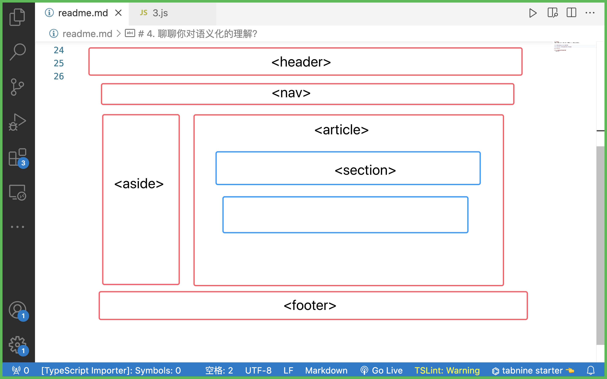

# 0  自我介绍
姓名 + 学校 +做过什么+ 有过什么成绩 +为什么能够胜任

# 1. 数组身上的方法,在js中的意义？
var arr=[]
arr.push(1)
arr.pop()

1.创建字面量在v8执行过程中相当于 new了一个构造函数，通常我们不去直接new构造函数因为够简洁直观
2.因为a相当于new Array()得到的，那么a的隐式原型(__proto__)===Array.prototype,v8查找属性的时候会在对象上查找，找不到就会顺着对象原型往上找

# 2.promise有几种状态？可以重复改变吗？
1.3种：Pending  Fulfilled  Rejected

- 红绿灯算法

# 3.输出结果

# 4.聊聊你对语义化得理解?

- 有哪些：header  nav-aside   article  section  footer

- 优点:可读性好，搜索引擎优化，更好的支持各种终端

# 5.斐波那契

# 6.用过什么AI工具
1.chatgpt(刻意练习prompt技巧，生成简单的前端网页，用于学习)
2.Copilot 提升开发效率
3.最近在学习transformer,openai技能，对大模型很感兴趣 langchain  llm 
4.自己准备一个大模型，介绍你对它的理解

# 7.请你讲一讲http的三次握手
- 三次握手是TCP协议连接时产生的
1.客户端发送连接请求到服务端，客户端状态进入，SYN-SEND
2.服务端收到请求报文后，返回一个应答（ACK 序号）,服务端进入SYN-RECVED状态
3.客户端接受到同意连接的应答后，还要向服务端发送一个确认（ACK 序号），客户端进入ESTABLISHED状态，服务端也进入ESTABLISHED状态，连接建立成功

- 为什么一定要三次握手，两次行不行？
不行，假设客户端给服务端发送了一个建立连接请求A，但是因为网络环境差，这个请求A超时了，那么TCP会启动超时重传的机制，再发送一个建立连接请求B，服务器接受到B请求后应答，如果此时就完成了建立连接的话，当客户端和服务端通讯完成后，便释放了连接，双方都进入了closed状态。假设此时A请求又抵达了服务端，那么服务端会认为客户端又要建立新的连接从而应答该请求并进入入ESTABLISHED状态，那么服务端就会一直等待，造成资源浪费。

- 四次挥手
1.客户端认为数据已经完成，向服务器B发送释放连接请求
2.B收到释放连接请求后，返回一个ACK报文并进入到CLOSE-WAIT状态,此时不再接受A发送的数据，但是可以发送数据给A
3.B如果此时还有没有发完的数据，就会继续发送，发完后向A发送释放连接的请求，B进入到LAST-ACK状态
4.A收到释放连接的请求，向B发送应答，B收到应答后，释放连接，B和A都进入了CLOSED状态。

## 8.说一说跨域
https://192.168.31.45:8080/user
协议号：域名/端口/路径

- 同源策略  协议号-域名-端口号都相同的地址，浏览器才认为是同源

- 跨域：后端返回给浏览器的数据会被浏览器的同源策略给拦截下来。响应接受不到。

- 同源策略的目的是数据安全

## 解决跨域(开发阶段好调试)
http：//192.168.31.1：8080（前端vue）
http：//192.168.31.2：8080（后端go）

1.JSONP
1.ajax受同源策略的影响，但是<script>标签上的src属性不受同源策略的影响，且该属性也会导致浏览器发送一个请求 

