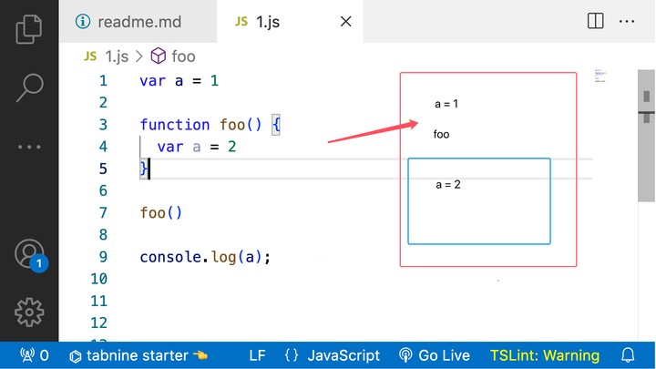
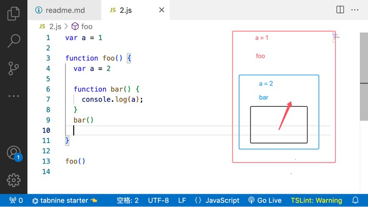

# 作用域
 - 1.js 是弱类型动态语言
 - 2.执行代码之前先需要编译

# 编译
 - 1.找到某个域当中的有效标识符

# 执行
 - 1.变量的查找会先从内层作用域查找，不能从外到内查找

# 全局作用域

# 函数体作用域

# 块级作用域

- 1.var 声明的变量存在声明提升，提升到当前作用域的顶端
- 2.函数声明也存在声明提升
//揭开声明提升背后的秘密

# let
 1.不会声明提升
 2.不能重复声明同一变量

